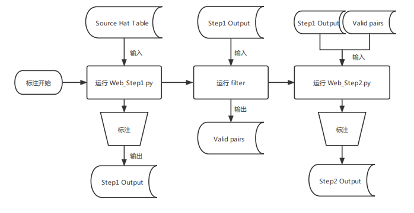

# Tracking Annotation Process

---

## 流程图：



---

## 依赖：

- python3.7
- pandas
- pywebio
- aifi-proto-tools

```bash
pip install -r requirements.txt
```

---

## 使用方法:

- web_step1:
    
    生成web界面对每个id对应的hat case进行检查，确保每个id下的所有的hat case对应的是同一个人
    
    参数
    
    ```markdown
    Arguments:
    			--path                The path to the hat table file  
    
    Options:
    			--load_cache          Load cached file to avoid repetition of annotation
    ```
    

- filter
    
    根据每两个id之间的时间与位置进行筛选，得到可能是同一个人的id pairs。
    
- web_step2:
    
    生成web界面，根据filter产生的id pairs对web_step1的结果进行检查。对属于同一个人的不同id进行合并。
    
    参数
    
    ```markdown
    Arguments:
    			--path                The path to the hat table file
    			--pair_path           The path to the valid pairs file
    
    Options:
    			--load_cache          Load cached file to avoid repetition of annotation
    ```